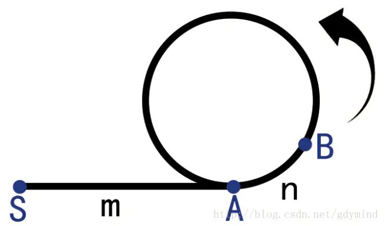

## 适用问题：
&emsp;如何检测一个链表是否有环，如果有，那么如何确定环的起点。

## 利用floyd判圈算法可以做到下面的三件事:
### 1. 判断是否有环
&emsp;使用两个指针 *slow* 和 *fast* 。两个指针都从链表的起始处 *S* 开始。 *slow* 每次向后移动一步， *fast* 每次向后移动两步。若在 *fast* 到达链表尾部前 *slow* 与 *fast* 相遇了，就说明链表有环。

### 2. 计算环的长度
&emsp;当 *slow* 和 *fast* 相遇时， *slow* 和 *fast* 必定在环上，所以只要让一者不动，另一者走一圈直到相遇，走过的节点数就是环的长度。

### 3. 寻找环的起点
&emsp;如上图所示，设 $AB=n$ ,  $SA=m$ 。设环的长度为 $L$ 。
假设 *slow* 走过的节点数为 $i$ ，那么有： $$i=m+n+a×L$$  $a$ 为 *slow* 绕过的环的圈数。
&emsp;因为 *fast* 速度为 *slow* 的两倍，所以相同时间走过的节点数为 *slow* 的两倍，所以有： $$2i=m+n+b×L$$  $b$ 为 *fast* 绕过的环的圈数。
&emsp;两者做差有 : $$i=(b-a)×L$$ 
&emsp;所以可知， *fast* 和 *slow* 走过的距离差是环的整数倍。则：$$m+n=L$$
&emsp;此时让 *slow* 回到起点 $S$ ， *fast* 仍然在 $B$ 。让两个指针以每次一步的速度往前走。当走了 $m$ 步时，可发现 *slow* 和 *fast* 正好都在 $A$ 处，即是环的起点。

