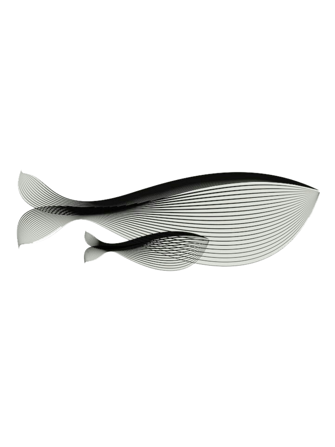

# leetcode two_sum
## 方法一：暴力遍历

**猪**

*猪*

***猪*** 前后要有空格

```cpp
#include <iostream>
```

姓名|性别|年龄
---|:--:|---:
张三|男|18
李四|男|19
朱雀|女|18

$$
\max_{0 \leq i \leq n-1} \{ f(i) \}
$$

$\textit{size\_t}$

&emsp;首行缩进

  有点像Linux文件路径


图片标签，可以只保留 $width$ 项